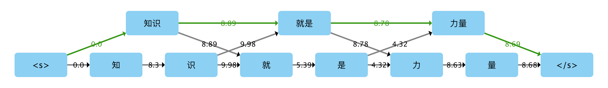
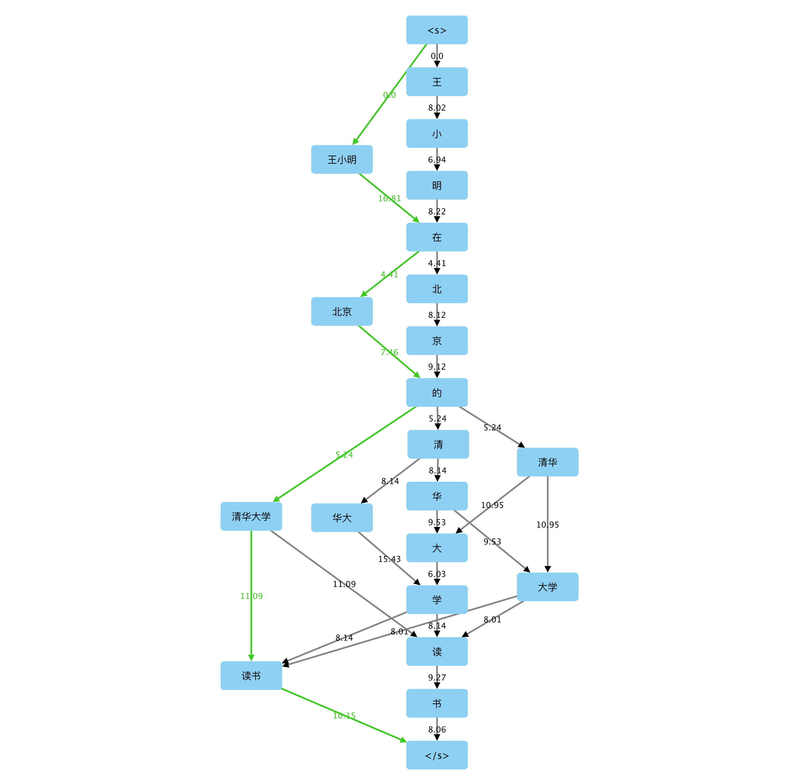

# 微型中文分词器

[](https://github.com/howl-anderson/MicroTokenizer/actions/workflows/python-package.yml)
[](https://pypi.python.org/pypi/MicroTokenizer)

一个微型的中文分词器，目前提供了以下几种分词算法:

1. 按照词语的频率（概率）来利用构建 DAG（有向无环图）来分词，使用 `Trie Tree` 构建前缀字典树
2. 使用隐马尔可夫模型（Hidden Markov Model，HMM）来分词
3. 融合 DAG 和 HMM 两种分词模型的结果，按照分词粒度最大化的原则进行融合得到的模型
4. 正向最大匹配法
5. 反向最大匹配法
6. 双向最大匹配法
7. 基于 CRF (Conditional Random Field, 条件随机场) 的分词方法
8. UnicodeScriptTokenizer: 当 Unicode Script 发生变化时拆分
9. EmsembelTokenizer: 按照 Unicode Script 切分文本，然后按照每个文本段的 Unicode Script 调用不同的分词器进行处理。

# 特点 / 特色

* 面向教育：可以导出 `graphml` 格式的图结构文件，辅助学习者理解算法过程
* 良好的分词性能：由于使用类似 `结巴分词` 的算法，具有良好的分词性能
* 具有良好的扩展性：使用和 `结巴分词` 一样的字典文件，可以轻松添加自定义字典
* 自定义能力强
* 提供工具和脚本帮助用户训练自己的分词模型而不是使用内建的模型

# 演示

## 在线演示

### 在线的 Jupyter Notebook
点击右侧图标，即可访问 [](https://mybinder.org/v2/gh/howl-anderson/MicroTokenizer/master?filepath=.notebooks%2FMicroTokenizer.ipynb)

### Online web demo
@ [http://nlp_demo.xiaoquankong.ai/](http://nlp_demo.xiaoquankong.ai/)

## 离线演示
### DAG 分词
代码：
```python
import MicroTokenizer

tokens = MicroTokenizer.cut("知识就是力量")
print(tokens)

```
输出：
```python
['知识', '就是', '力量']
```

#### 加载用户字典
```python
import MicroTokenizer

tokens = MicroTokenizer.cut("「杭研」正确应该不会被切开", HMM=False)
print(tokens)

# loading user's custom dictionary file
MicroTokenizer.load_userdict('user_dict.txt')

tokens = MicroTokenizer.cut("「杭研」正确应该不会被切开", HMM=False)
print(tokens)

```

`user_dict.txt` 的内容为：
```text
杭研 10

```

输出:
```text
['「', '杭', '研', '」', '正确', '应该', '不会', '被', '切开']
['「', '杭研', '」', '正确', '应该', '不会', '被', '切开']

```

### 有向无环图效果演示


#### 备注
* `<s>` 和 `</s>` 是图的起始和结束节点，不是实际要分词的文本
* 图中 Edge 上标注的是 `log(下一个节点的概率的倒数)`
* 最短路径已经用 `深绿色` 作了标记

### 更多 DAG 分词的演示
#### "王小明在北京的清华大学读书"


### HMM 分词
因 HMM 模型单独分词性能不佳, 一般情况下只用于和其他模型的融合, 故不在此提供示例, 需要演示者,可在 在线的 Jupyter Notebook 找到使用的例子.

### DAG+HMM 分词
将前两个模型的结果融合，融合了 DAG 稳定的构词能力和 HMM 的新词发现能力，缺点是速度较慢

### 正向最大匹配法

具体介绍，请阅读博文 [构建中文分词器 - 正向最大匹配法](http://blog.xiaoquankong.ai/%E6%9E%84%E5%BB%BA%E4%B8%AD%E6%96%87%E5%88%86%E8%AF%8D%E5%99%A8-%E6%AD%A3%E5%90%91%E6%9C%80%E5%A4%A7%E5%8C%B9%E9%85%8D%E6%B3%95/)

### 反向最大匹配法

具体介绍，请阅读博文 [构建中文分词器 - 反向最大匹配法](http://blog.xiaoquankong.ai/%E6%9E%84%E5%BB%BA%E4%B8%AD%E6%96%87%E5%88%86%E8%AF%8D%E5%99%A8-%E5%8F%8D%E5%90%91%E6%9C%80%E5%A4%A7%E5%8C%B9%E9%85%8D%E6%B3%95/)

### 双向最大匹配法

具体介绍，请阅读博文 [构建中文分词器 - 双向最大匹配法](http://blog.xiaoquankong.ai/%E6%9E%84%E5%BB%BA%E4%B8%AD%E6%96%87%E5%88%86%E8%AF%8D%E5%99%A8-%E5%8F%8C%E5%90%91%E6%9C%80%E5%A4%A7%E5%8C%B9%E9%85%8D%E6%B3%95/)

### 基于 CRF 的分词

TODO

# 依赖
只在 python 3.6+ 环境测试过，其他环境不做兼容性保障。

# 安装

```bash
pip install MicroTokenizer
```

# 如何使用

## 分词

```python
from MicroTokenizer import (
    hmm_tokenizer,
    crf_tokenizer,
    dag_tokenizer,
    max_match_forward_tokenizer,
    max_match_backward_tokenizer,
    max_match_bidirectional_tokenizer,
)

input_text = "王小明在北京的清华大学读书。"

# 使用相关的算法来分词。

result = hmm_tokenizer.segment(input_text)
print(result)

result = crf_tokenizer.segment(input_text)
print(result)

result = max_match_forward_tokenizer.segment(input_text)
print(result)

result = max_match_backward_tokenizer.segment(input_text)
print(result)

result = max_match_bidirectional_tokenizer.segment(input_text)
print(result)

result = dag_tokenizer.segment(input_text)
print(result)

```

输出：

```python
['小', '明', '在', '北京', '的', '清华大学', '读书', '。']

```

## Unicode Script 分词

```python
from MicroTokenizer.tokenizers.unicode_script.tokenizer import UnicodeScriptTokenizer


tokenizer = UnicodeScriptTokenizer()
tokens = tokenizer.segment("2021年时我在Korea的汉城听了이효리的にほんご这首歌。")
print([(token.text, token.script) for token in tokens])

```

输出：

```python
[('2021', 'Common'), ('年时我在', 'Han'), ('Korea', 'Latin'), ('的汉城听了', 'Han'), ('이효리', 'Hangul'), ('的', 'Han'), ('にほんご', 'Hiragana'), ('这首歌', 'Han'), ('。', 'Common')]
```

## Ensemble 分词

### 区分语言进行处理

```python
from MicroTokenizer.tokenizers.ensemble.tokenizer import EnsembleTokenizer
from MicroTokenizer import dag_tokenizer


tokenizer = EnsembleTokenizer({"Han": dag_tokenizer})
tokens = tokenizer.segment("2021年时我在Korea的汉城听了이효리的にほんご这首歌。")
print(tokens)

```

输出：

```python
['2021', '年', '时', '我', '在', 'Korea', '的', '汉城', '听', '了', '이효리', '的', 'にほんご', '这', '首', '歌', '。']
```

### [实验性质] 基于流水线的分词方案

可以稳定的提取数字和电子邮箱地址。可以区分中文英文采用不同的分词方案（英文默认按照空格切分）。

```python
from MicroTokenizer.experimental import dag_tokenizer

tokens = dag_tokenizer.segment("我的电话是15555555555，邮箱是xxx@yy.com,工作单位是 Tokyo University。")
print(tokens)
```

输出：

```python
['我', '的', '电话', '是', '15555555555', '，', '邮箱', '是', 'xxx@yy.com', ',', '工作', '单位', '是', 'Tokyo', 'University', '。']
```

## 导出 GraphML 文件

针对基于 DAG 的算法，用户可以导出 GraphML 文件，研究其工作原理。

```python
from MicroTokenizer import dag_tokenizer

dag_tokenizer.graph_builder.build_graph("知识就是力量")
dag_tokenizer.graph_builder.write_graphml("output.graphml")

```

NOTE: 导出后的 `graphml` 文件可以使用 [Cytoscape](http://www.cytoscape.org/) 进行浏览和渲染

## 如何训练自己的模型
MicroTokenizer 也提供了工具帮助你训练模型。

### 代码训练

```python
from MicroTokenizer.training.train import train

# you can use multiple files as training data, it is a list
train(["./corpus.txt"], "./model_data")

```

## 如何使用自己的模型

```python
from MicroTokenizer import MaxMatchBackwardTokenizer
from MicroTokenizer import MaxMatchForwardTokenizer
from MicroTokenizer import MaxMatchBidirectionalTokenizer
from MicroTokenizer import DAGTokenizer
from MicroTokenizer import HMMTokenizer
from MicroTokenizer import CRFTokenizer

model_dir = "path/to/your/model"
input_text = "你的待分词文本"

max_match_backward_tokenizer = MaxMatchBackwardTokenizer.load(model_dir)
tokens = max_match_backward_tokenizer.segment(input_text)

max_match_forward_tokenizer = MaxMatchForwardTokenizer.load(model_dir)
tokens = max_match_forward_tokenizer.segment(input_text)

max_match_bidirectional_tokenizer = MaxMatchBidirectionalTokenizer.load(model_dir)
tokens = max_match_bidirectional_tokenizer.segment(input_text)

dag_tokenizer = DAGTokenizer.load(model_dir)
tokens = dag_tokenizer.segment(input_text)

hmm_tokenizer = HMMTokenizer.load(model_dir)
tokens = hmm_tokenizer.segment(input_text)

crf_tokenizer = CRFTokenizer.load(model_dir)
tokens = crf_tokenizer.segment(input_text)

```


# Roadmap
* [DONE] DAG 模型融合 HMM 模型 以处理 OOV 以及提高 Performance
* [DONE] 和主流分词模型做一个分词能力的测试 @ [中文分词软件基准测试 | Chinese tokenizer benchmark](https://github.com/howl-anderson/Chinese_tokenizer_benchmark)
* [DONE] 使用 `Trie Tree` 来压缩运行时内存和改善前缀查找速度
* [DONE] 允许添加自定义 DAG 词典
* [DONE] 开发自定义 DAG 字典构造 Feature, 允许用户构建自己的 DAG 字典
* [DONE] 开发自定义 HMM 参数构建 Feature, 允许用户训练自己的 HMM 模型
* [DONE] 引入 CRF 分词模型，使用 python-crfsuite
* [DOING] 模型系统分成代码和模型两个部分，用户可以选择性的下载和安装模型以及让用户训练和安装定制的模型
* [TODO] 引入 char-level word embedding + Bi-LSTM + CRF 分词模型，参考 [FoolNLTK](https://github.com/rockyzhengwu/FoolNLTK)
* [TODO] 将预测和训练代码分成不同的模块
* [DOING] 添加测试代码，确保功能正常和 Python 2/3 的兼容性
* [TODO] 增加并发处理的能力
* [TODO] 允许用户非常方便的训练自己的模型包
* [DONE] 使用人明日报字典替换 jieba 提供的字典
* [TODO] 添加 jieba 兼容的 banana peel 接口
* [TODO] 使用 scikit-crfsuite 替代 python-crfsuite
* [TODO] 移除对于模型的下载、安装、连接等支持（资源有限，无力支持）